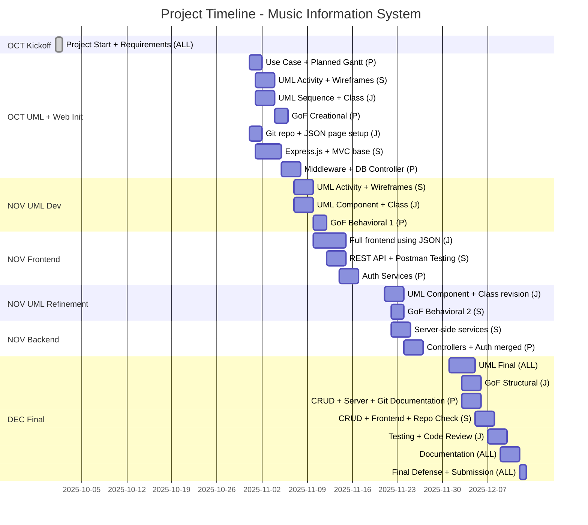

## Music Information System

Advanced Web Programming & Object-Oriented Analysis and Design with UML Project

## Overview

The Music Information System is a web-based application designed to provide detailed information about musical artists and their works.
It allows users to search for artists, explore their albums and songs, and view metadata such as nationality, language, number of listens, and relationships between artists and productions.

This project demonstrates the integration of web technologies, database management, and object-oriented design principles using UML.

## Installation

You can find our project on GitHub by following this link: https://github.com/Safiane/Project_S5

## Technologies Used

- Database: MySQL
- UML Design: Visual Paradigm
- Version Control: Git & GitHub

## Authors & Contact

- Castets Peïo, peio.castets@efrei.net
- Ras El Qdim Safiane, safiane.ras-el-qdim@efrei.net
- Jin Johnny, johnny.jin@efrei.net

## License

This project is developed for academic purposes as part of the Advanced Web Programming and Object-Oriented Analysis and Design with UML courses.

## Credits and Acknowledgments:

We would like to thank the EFREI engineering school, the ESSCA school, and the teaching staff for providing us with the resources necessary to carry out this project.

## End

Thank you for taking the time to read this, and enjoy using our project!

